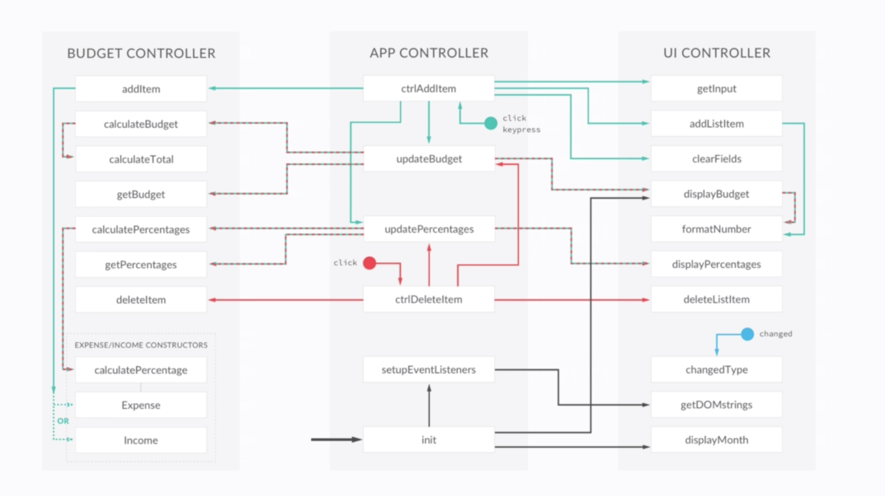

# Budget_App  Architecture

## Some Notes for myself

### Module Patern

https://medium.com/javascript-in-plain-english/javascript-design-pattern-module-pattern-555737eccecdThe Module Pattern is one of the most common design patterns used in JavaScript and for good reason. The module pattern is easy to use and creates encapsulation of our code. Modules are commonly used as singleton style objects where only one instance exists. The Module Pattern is great for services and testing/TDD. There are many different variations of the module pattern so for now I will be covering the basics and the Revealing Module Pattern in ES5.
Something to note, the next version of JavaScript ES6 has a new specification for asynchronous module loading. You can use the module patterns that will be covered with the new ES6 module loading syntax.

### Separation of concerns 

Separation of concerns is the idea that each module or layer in an application should only be responsible for one thing and should not contain code that deals with other things. Separating concerns reduces code complexity by breaking a large application down into many smaller units of encapsulated functionality.

### Encapsulation

Encapsulation means information hiding. It's about hiding as much as possible of the object's internal parts and exposing a minimal public interface. The simplest and most elegant way to create encapsulation in JavaScript is using closures. A closure can be created as a function with private state.

Encapsulation is one of the fundamental concepts in object-oriented programming (OOP). It describes the idea of bundling data and methods that work on that data within one unit, This concept is also often used to hide the internal representation, or state, of an object from the outside.

### Singleton

Singleton is an object which can only be instantiated once. A singleton pattern creates a new instance of the class if one doesn't exist. If an instance already exists, it returns the reference to that object. Technically speaking, object literals in JavaScript are singletons.
